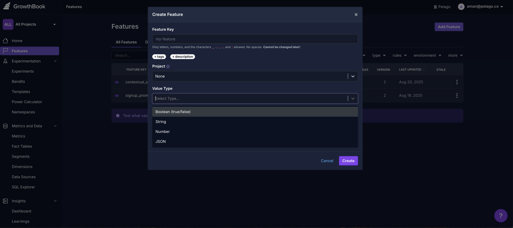

# GrowthBook Complete Setup Guide

> **A comprehensive guide for implementing A/B testing and feature flags with GrowthBook**

## 🏗️ Our Architecture

**Deployment Strategy**: GrowthBook is self-hosted on **AWS ECS within our VPC**, providing secure access to our Redshift events database.

**Key Benefits:**
- 🔒 **Secure**: Runs within our private VPC with direct database access
- 🚀 **Performance**: No external API calls to cloud services
- 💾 **Data Control**: All experiment data stays within our infrastructure
- 🔗 **Integrated**: Direct read-only access to Redshift events database

**Team Workflow:**
- **Data/Infra Team**: Manages GrowthBook ECS deployment and Redshift connectivity
- **Product Teams**: Create fact tables directly in Redshift and define metrics
- **Engineering Teams**: Integrate SDKs and implement feature flags

## 🚀 Quick Start

GrowthBook is an open-source platform for A/B testing and feature flag management. This guide walks you through the complete setup from data connection to running experiments.

### What You'll Learn
- ✅ Connect your Redshift data warehouse
- ✅ Create fact tables and metrics 
- ✅ Set up feature flags and experiments
- ✅ Integrate SDKs (Python & Next.js)
- ✅ Analyze experiment results
- ✅ Make data-driven decisions

---

## 📋 Table of Contents

1. [🔌 Data Source Setup](#-data-source-setup)
2. [📊 Fact Tables & Metrics](#-fact-tables--metrics)
3. [🎯 Targeting & Attributes](#-targeting--attributes)
4. [🚩 Feature Flags & Experiments](#-feature-flags--experiments)
5. [💻 SDK Integration](#-sdk-integration)
6. [📈 Analysis & Management](#-analysis--management)
7. [⚡ Advanced Features](#-advanced-features)

---

## 🔌 Data Source Setup

### Redshift Configuration

> **Note**: The **Data/Infra team** has already configured the Redshift data source connection in GrowthBook. This section is for reference only.

GrowthBook connects to our Redshift data warehouse to power analytics and experimentation.


#### Pre-configured Setup
The Data/Infra team has already configured:
- ✅ **Redshift Connection**: Secure connection within our VPC
- ✅ **Read-only Access**: Dedicated GrowthBook user with SELECT permissions
- ✅ **Network Security**: VPC security group rules for GrowthBook ECS access
- ✅ **SSL Configuration**: Encrypted connection to Redshift

#### Connection Details (Reference)
- **Host**: Internal Redshift endpoint within VPC
- **Database**: Events database
- **User**: `growthbook_readonly` (managed by Data/Infra team)
- **Port**: 5439 (standard Redshift port)
- **SSL**: Enabled for secure communication

#### Connection Status
- ✅ **Type**: Redshift
- ✅ **Status**: Connected  
- 🔄 **Sync**: Auto-updates every 24 hours
- 📊 **Projects**: Available across all workspaces

---

## 📊 Fact Tables & Metrics

### Understanding Fact Tables

Fact tables are the cornerstone of GrowthBook's metrics system - they're SQL-based data sources that transform your raw event data into analyzable metrics for experiments.


#### What Are Fact Tables?

A Fact Table is essentially a **SQL SELECT statement** that defines how GrowthBook should read your event data. Think of it as a "view" into your data warehouse that:

- **Standardizes Data**: Creates a consistent structure for metrics calculation
- **Enables Flexibility**: One fact table can power multiple different metrics
- **Optimizes Performance**: Pre-filters and structures data for fast analysis
- **Supports Various Sources**: Works with raw events, modeled tables, or pre-aggregated data

#### Required Structure

Every fact table must have:

**🔑 Required Columns:**
- **`timestamp`**: When the event occurred (date/datetime)
- **User Identifier(s)**: At least one column to identify users
  - `user_id`: For logged-in users
  - `anonymous_id`: For anonymous users  
  - `ds_user_id`: Your custom user identifier

**📊 Optional Columns:**
- **Event Data**: Purchase amounts, page views, click types
- **Dimensions**: Device type, country, campaign source
- **Filters**: Status codes, event categories, feature flags

#### How They Power Metrics

```
Fact Table → Multiple Metrics
     ↓
┌─ Conversion Rate (clicks/views)
├─ Average Order Value (sum/count)
├─ Purchase Rate (buyers/visitors)  
└─ Revenue Per User (revenue/users)
```

One well-designed fact table can generate dozens of different metrics!

### Creating a Fact Table

#### Example: Product View Events
```sql
SELECT 
    event_time as timestamp,
    ds_user_id,
    ds_session_id,
    event_type,
    page_name,
    attribute_id,
    attribute_name,
    attribute_value,
    country,
    device,
    os,
    browser,
    geo_country_code,
    geo_city,
    locale
FROM public.traveller_events_v2 
WHERE page_name = 'product_listing'
    AND attribute_value IS NOT NULL
    AND attribute_value LIKE '%"id":%'
    AND event_time >= CURRENT_DATE - INTERVAL '1 month'
```

#### Configuration Steps
1. **Name Your Table**: `events(gplp)` - descriptive identifier
2. **Add SQL Query**: Your event extraction query
3. **Set Identifier**: `ds_user_id` as the primary user identifier
4. **Configure Dimensions**: Add columns for segmentation
5. **Test & Save**: Verify query returns expected data

### Metrics Configuration

Metrics are how you measure experiment success - they transform fact table data into measurable business outcomes.


#### Understanding Metric Types

GrowthBook provides several powerful metric types, each suited for different analysis needs:

**🎯 Proportion Metrics**
- **Purpose**: Measure what percentage of users performed an action
- **Use Cases**: Conversion rates, feature adoption, click-through rates
- **How it Works**: Counts users who appear in your fact table ÷ total experiment users
- **Example**: "What % of users signed up?" = Users in signup fact table ÷ All users

**📊 Mean Metrics** 
- **Purpose**: Analyze average user behavior and values
- **Aggregation Options**:
  - `COUNT(*)`: Average events per user
  - `SUM(column)`: Average total value per user (e.g., revenue)
  - `MAX(column)`: Average maximum value per user
  - `COUNT(DISTINCT column)`: Average unique items per user
- **Example**: Average order value, sessions per user, pages viewed

**⚖️ Ratio Metrics**
- **Purpose**: Compare two different quantities with custom denominators
- **Use Cases**: CTR (clicks/impressions), conversion rate, revenue per visit
- **Power**: Can use different fact tables for numerator and denominator
- **Example**: CTR = Click events ÷ Impression events

**📈 Quantile Metrics**
- **Purpose**: Analyze distribution and outliers at specific percentiles
- **Use Cases**: Load time analysis, revenue distribution, engagement patterns
- **Example**: "95th percentile page load time" - helps identify performance issues

#### Metric Best Practices

**✅ Choose the Right Type:**
- Proportion: "Did user do X?" (binary outcome)
- Mean: "How much did user do?" (average behavior)  
- Ratio: "X per Y" (efficiency/rate metrics)
- Quantile: "Distribution analysis" (outliers/extremes)

**✅ Metric Windows:**
- Define time periods for metric calculation
- Account for delayed conversions
- Balance recency vs. statistical power

#### Example: Click-Through Rate (CTR) Metric

**Configuration:**
- **Name**: `product_ctr`
- **Type**: Ratio
- **Numerator**: Click events (`event_type = 'click'`)
- **Denominator**: Exposure events (`event_type = 'exposure'`)
- **Value**: Unique Users

**SQL Preview:**
```sql
-- Numerator (Clicks)
SELECT `ds_user_id` AS user, 1 AS value
FROM `events(gplp)`
WHERE (event_type = 'click') AND timestamp >= exposure_timestamp
GROUP BY user

-- Denominator (Exposures)  
SELECT `ds_user_id` AS user, 1 AS value
FROM `events(gplp)`
WHERE (event_type = 'exposure') AND timestamp >= exposure_timestamp
GROUP BY user
```

---

## 🎯 Targeting & Attributes

### User Attributes

Attributes are the key-value pairs that enable precise targeting and personalization in GrowthBook. They're the "data about users" that power intelligent experiment assignment and feature flag decisions.


#### What Are Attributes?

Attributes are **user context data** passed from your application to GrowthBook, enabling:

**🎯 Precise Targeting:**
- Show experiments only to specific user segments
- Control feature access based on user properties
- Create dynamic, personalized experiences

**🔍 Experiment Assignment:**
- Determine which users see which variations
- Ensure consistent experience across sessions
- Enable complex targeting logic

**📊 Analysis Segmentation:**
- Break down results by user characteristics
- Understand how different groups respond
- Identify high-value user segments

#### Attribute Data Types

GrowthBook supports rich data types for flexible targeting:

**🔤 String:** `country: "US"`, `plan: "premium"`
- Text values, exact matching
- Supports regex patterns for advanced matching

**🔢 Number:** `age: 25`, `session_count: 42`
- Numeric comparisons (>, <, =, >=, <=)
- Mathematical operations in targeting

**✅ Boolean:** `is_premium: true`, `email_verified: false`  
- True/false flags
- Simple on/off conditions

**📋 Enum:** `device_type: ["mobile", "desktop", "tablet"]`
- Predefined list of allowed values
- Ensures data consistency

**🗂️ Array:** `features: ["feature_a", "feature_b"]`
- Multiple values per attribute
- "Contains" and "includes" logic

**🔐 Secure String:** `email: "user@example.com"`
- Hashed before sending to GrowthBook
- Privacy-preserving targeting

#### How Targeting Works

```
User Request → SDK → GrowthBook
     ↓
Attributes: {
  id: "user123",
  country: "US", 
  is_premium: true,
  age: 28
}
     ↓
Targeting Rules: 
IF country = "US" AND age >= 18 AND is_premium = true
     ↓
✅ User sees experiment!
```

#### Privacy & Security

- **Local Processing**: Attributes stay in your SDK, never sent to GrowthBook servers
- **Secure Hashing**: Sensitive data can be hashed before comparison
- **Minimal Data**: Only pass attributes you actually use for targeting

### Production Attributes Schema

| Attribute | Type | Description | Example |
|-----------|------|-------------|---------|
| `id` | string | Primary user identifier | `user_12345` |
| `ds_user_id` | string | Data source user ID | `user_12345` |
| `ds_session_id` | string | Session identifier | `session_abc123` |
| `user_agent` | string | Browser user agent | `Mozilla/5.0...` |
| `geo_country_code` | string | Country code | `US`, `GB`, `DE` |
| `geo_city` | string | User's city | `New York`, `London` |
| `currency_id` | string | User's currency | `USD`, `EUR`, `GBP` |
| `locale` | string | User's locale | `en-US`, `de-DE` |
| `utm` | object | UTM campaign data | `{source: "google", medium: "cpc"}` |
| `forwarded_for` | string | IP address | `192.168.1.1` |
| `is_kf_verified` | boolean | Verification status | `true`, `false` |
| `platform` | string | Platform type | `web`, `mobile`, `app` |

### Adding New Attributes
1. **Go to Settings** → **Attributes** 
2. **Click "Add Attribute"**
3. **Define Properties**:
   - Name (must match SDK implementation)
   - Data type (string, number, boolean, enum)
   - Description for team reference
4. **Set Project Access** → Save

---

## 🚩 Feature Flags & Experiments

### The Feature-First Approach

**Important**: Always start with a feature flag, then add experiment rules. This ensures proper lifecycle management and easy rollbacks.

### Creating Feature Flags

#### Step 1: Create the Feature



1. **Navigate to Features** → "Add Feature"
2. **Configure**:
   - **Feature Key**: `signup_promo` (unique identifier - cannot be changed later)
   - **Description**: "Signup promotion experiment"
   - **Type**: JSON (for complex experiments)
   - **Default Value**: `{"discount": 0, "type": "control"}`
   - **Tags**: Optional labels for organization
   - **Project**: Select the appropriate project workspace

#### Feature Key Best Practices
- **Descriptive**: `new_checkout_flow` vs `experiment_1`
- **Consistent**: Use snake_case or kebab-case consistently
- **Permanent**: Cannot be changed after creation
- **Unique**: Must be unique across your entire GrowthBook instance

### Adding Rules to Features

Rules control how features behave for different user segments.


#### Rule Types

**📋 Manual Implementation**
- **Force Value**: Give specific user groups the same value
- **Percentage Rollout**: Release to a percentage while monitoring

**🔬 Data-Driven Implementation** 
- **Safe Rollout** (Pro): Gradual release with automatic guardrail monitoring
- **Experiment**: A/B test to measure feature impact
- **Bandit** (Pro): Multi-armed bandit optimization

### Setting Up Experiments

#### Recommended Workflow
1. **Feature Flag First** → Create your feature flag
2. **Add Experiment Rule** → Choose "Experiment" rule type
3. **Configure Experiment** → Follow the setup wizard
4. **Link to Feature** → Experiment becomes a rule within the feature

This approach provides:
- 🔄 Easy rollback capabilities
- 📊 Gradual rollout control  
- 🎯 Consistent targeting
- 📈 Proper lifecycle management

#### Step 1: Experiment Overview


**Configuration:**
- **Project**: Select your workspace
- **Name**: Descriptive experiment name
- **Tracking Key**: Unique identifier for analytics
- **Hypothesis**: Clear expected outcome
- **Description**: Detailed experiment context

#### Step 2: Traffic & Variations


**Settings:**
- **Assignment Attribute**: Usually `id` or `ds_user_id`
- **Hashing Algorithm**: V2 (recommended for bias reduction)
- **Traffic Allocation**: Start with 10-20% for safety
- **Variations**:
  - Control: Baseline experience
  - Treatment: New experience being tested

#### Step 3: Targeting Rules  


**Options:**
- **Saved Groups**: Pre-defined user segments
- **Attribute Conditions**: Dynamic targeting rules
- **Advanced Logic**: Complex Boolean conditions
- **Prerequisites**: Dependent feature requirements

**Example Targeting:**
```
IF geo_country_code equals "US" 
AND is_kf_verified equals true
AND platform equals "web"
```

#### Step 4: Success Metrics


**Configuration:**
- **Primary Metrics**: Key success indicators (limit to 1-2)
  - Choose your most important business metric (e.g., conversion rate, revenue)
  - This determines if your experiment "wins" or "loses"
- **Secondary Metrics**: Supporting measurements
  - Additional metrics to understand broader impact
  - Help validate or explain primary metric results
- **Guardrail Metrics**: Metrics that shouldn't decline
  - Protect against negative side effects
  - Automatically flag if experiment harms important areas

### Complex Feature Examples

#### JSON Feature Configuration

**Example 1: Signup Promotion (Multi-variation)**
```json
{
  "control": {
    "discount": 0,
    "type": "control"
  },
  "treatment_20": {
    "discount": 20,
    "type": "treatment"
  },
  "treatment_30": {
    "discount": 30,
    "type": "treatment"
  }
}
```

**Example 2: Button Color A/B Test (Simple string)**
Feature Key: `cta_button_color`
Feature Type: `string`
Default Value: `"blue"`

**Experiment Variations:**
- **Control**: `"blue"` (🔵 Get Started)
- **Treatment**: `"red"` (🔴 Sign Up Now!)

This tests whether red buttons perform better than blue buttons for signup conversion.

---

## 💻 SDK Integration

### Python SDK (Production Implementation)

```python
"""
GrowthBook integration helper for A/B testing and feature flags.
"""
import requests
from typing import Optional, Dict, Any, Callable
from growthbook import GrowthBook

from helper.utils import (
    get_ds_user_id, get_ds_session_id, get_user_agent, 
    get_user_country, get_user_city, get_user_currency, 
    get_user_locale, get_utm_params, get_ip_address,
    get_kf_verified_status
)
from library.logging_lib import get_logger
from settings import config
from common_assets.base.utils import fetch_platform_type

logger = get_logger(__name__)
_growthbook = None

def get_growthbook_attributes() -> Dict[str, Any]:
    """Get all user attributes for GrowthBook."""
    attributes = {
        "id": get_ds_user_id(), 
        "ds_user_id": get_ds_user_id(),
        "ds_session_id": get_ds_session_id(),
        "user_agent": get_user_agent(),
        "geo_country_code": get_user_country(),
        "geo_city": get_user_city(),
        "currency_id": get_user_currency(),
        "locale": get_user_locale(),
        "utm": get_utm_params(),
        "forwarded_for": get_ip_address(),
        "is_kf_verified": get_kf_verified_status(),
        "platform": fetch_platform_type()
    }
    # Remove None values
    return {k: v for k, v in attributes.items() if v is not None and v != ""}

def on_experiment_viewed(experiment, result):
    """Auto-log experiment exposures to data warehouse."""
    try:
        logger.info(f"[GROWTHBOOK] 🔬 Experiment: {experiment.key} → {result.variationId}")
        
        exposure_data = {
            "ds_user_id": get_ds_user_id(),
            "experiment_id": experiment.key,
            "variation_id": result.key,
            "attributes": get_growthbook_attributes(),
            "source": "search_core_python"
        }

        response = requests.post(
            config.EXPOSURE_API_BASE_URL,
            json=exposure_data,
            headers={"Content-Type": "application/json"},
            timeout=5
        )

        if response.status_code == 200:
            logger.info(f"[GROWTHBOOK] ✅ Exposure logged: {experiment.key}")
        else:
            logger.error(f"[GROWTHBOOK] ❌ API error: {response.status_code}")

    except Exception as e:
        logger.error(f"[GROWTHBOOK] Exposure logging failed: {str(e)}")

def initialize_growthbook() -> bool:
    """Initialize GrowthBook singleton."""
    global _growthbook
    
    try:
        _growthbook = GrowthBook(
            api_host="http://10.0.31.135/api",
            client_key="sdk-ATi82gwSt8HCUwx8",
            attributes=get_growthbook_attributes(),
            on_experiment_viewed=on_experiment_viewed,
            cache_ttl=300
        )
        
        _growthbook.load_features()
        logger.info("[GROWTHBOOK] 🚀 Initialized successfully")
        return True
        
    except Exception as e:
        logger.error(f"[GROWTHBOOK] Initialization failed: {e}")
        return False

def is_feature_enabled(feature_name: str) -> bool:
    """Check if feature is enabled for current user."""
    if not _growthbook:
        return False
    try:
        return _growthbook.is_on(feature_name)
    except Exception as e:
        logger.error(f"[GROWTHBOOK] Feature check error: {e}")
        return False

def get_feature_value(feature_name: str, default=None):
    """Get feature value/variant for current user."""
    if not _growthbook:
        return default
    try:
        return _growthbook.get_feature_value(feature_name, default)
    except Exception as e:
        logger.error(f"[GROWTHBOOK] Feature value error: {e}")
        return default

# Usage Examples:
initialize_growthbook()

# Simple feature flag
if is_feature_enabled("new_search_ui"):
    render_new_search()
else:
    render_old_search()

# Complex feature with variations  
promo_config = get_feature_value("signup_promo", {"discount": 0, "type": "control"})
if promo_config["discount"] > 0:
    show_discount_banner(promo_config["discount"], f"{promo_config['discount']}% off!")
```

### Next.js SDK Implementation

```javascript
import { GrowthBook } from "@growthbook/growthbook-react";
import { useEffect, useState } from 'react';

// Configuration
const CONFIG = {
  API_HOST: "http://10.0.31.135/api",
  CLIENT_KEY: "sdk-ATi82gwSt8HCUwx8",
  EXPOSURE_API: "http://10.0.31.135/exposure"
};

// Utility Functions
const getGrowthbookAttributes = () => {
  const attributes = {
    id: getUserId(),
    ds_user_id: getUserId(),
    ds_session_id: getSessionId(),
    user_agent: navigator.userAgent,
    geo_country_code: getUserCountry(),
    geo_city: getUserCity(),
    currency_id: getCurrency(),
    locale: navigator.language,
    utm: getUtmParams(),
    forwarded_for: getClientIP(),
    is_kf_verified: isKfVerified(),
    platform: isMobile() ? 'mobile' : 'web'
  };

  // Clean null values
  return Object.fromEntries(
    Object.entries(attributes).filter(([_, v]) => v != null && v !== '')
  );
};

// Auto-log experiment exposures
const onExperimentViewed = async (experiment, result) => {
  console.log(`🔬 Experiment: ${experiment.key} → ${result.key}`);
  
  try {
    const exposureData = {
      ds_user_id: getUserId(),
      experiment_id: experiment.key,
      variation_id: result.key,
      attributes: getGrowthbookAttributes(),
      source: "nextjs_web"
    };

    const response = await fetch(CONFIG.EXPOSURE_API, {
      method: 'POST',
      headers: { 'Content-Type': 'application/json' },
      body: JSON.stringify(exposureData)
    });

    if (response.ok) {
      console.log(`✅ Exposure logged: ${experiment.key}`);
    } else {
      console.error(`❌ API error: ${response.status}`);
    }
  } catch (error) {
    console.error('Exposure logging failed:', error);
  }
};

// GrowthBook Hook
const useGrowthBook = () => {
  const [gb, setGb] = useState(null);

  useEffect(() => {
    const growthbook = new GrowthBook({
      apiHost: CONFIG.API_HOST,
      clientKey: CONFIG.CLIENT_KEY,
      attributes: getGrowthbookAttributes(),
      onExperimentViewed: onExperimentViewed
    });

    growthbook.loadFeatures().then(() => {
      console.log('🚀 GrowthBook initialized');
      setGb(growthbook);
    });

    return () => growthbook.destroy();
  }, []);

  return gb;
};

// React Components
export default function App() {
  const gb = useGrowthBook();

  if (!gb) return <LoadingSpinner />;

  return (
    <div>
      <Header />
      <ProductListing growthbook={gb} />
      <Footer />
    </div>
  );
}

function ProductListing({ growthbook }) {
  // Simple feature flag
  const newSearchEnabled = growthbook.isOn("new_search_ui");
  
  // Complex feature with variations
  const promoConfig = growthbook.getFeatureValue("signup_promo", {
    discount: 0,
    type: "control"
  });

  // Button color A/B test example
  const buttonColor = growthbook.getFeatureValue("cta_button_color", "blue");

  return (
    <div>
      {newSearchEnabled ? (
        <NewSearchInterface />
      ) : (
        <LegacySearchInterface />
      )}
      
      {promoConfig.discount > 0 && (
        <PromoBanner 
          discount={promoConfig.discount}
          message={`${promoConfig.discount}% off!`}
        />
      )}
      
      {/* Button Color A/B Test */}
      <button 
        className={`cta-button ${buttonColor === "red" ? "bg-red-500 hover:bg-red-600" : "bg-blue-500 hover:bg-blue-600"} text-white px-6 py-3 rounded-lg font-semibold`}
        onClick={handleSignup}
      >
        {buttonColor === "red" ? "🔴 Sign Up Now!" : "🔵 Get Started"}
      </button>
      
      <ProductGrid />
    </div>
  );
}

// Helper functions (implement based on your system)
function getUserId() { 
  return localStorage.getItem('user_id') || 'anonymous';
}

function getSessionId() {
  return sessionStorage.getItem('session_id') || generateSessionId();
}

function getUserCountry() {
  return localStorage.getItem('country') || detectCountry();
}

// ... other helpers
```

---

## 📈 Analysis & Management

### Monitoring Experiment Results

Track your experiments in real-time and make data-driven decisions.

#### Results Dashboard
1. **Navigate to Experiments** → Select your experiment
2. **Click "Update"** to fetch latest data
3. **Review Key Metrics**:
   - **Baseline**: Control group performance
   - **% Change**: Treatment vs control difference
   - **Confidence Interval**: Statistical significance
   - **Sample Size**: Number of users per variation

### Statistical Significance

- **Green**: Statistically significant improvement
- **Red**: Statistically significant decline  
- **Gray**: Not statistically significant (need more data)

### Stopping Experiments

When you have conclusive results:


#### Decision Process
1. **Click "Stop Experiment"**
2. **Choose Conclusion**:
   - **Won**: Treatment outperformed control
   - **Lost**: Control outperformed treatment  
   - **Inconclusive**: No clear winner
3. **Temporary Rollout**: Keep experiment running while coding changes
4. **Select Winning Variation**: Choose what to make permanent


### Making Changes Live


#### Release Process
1. **Select Winner**: Choose the winning variation
2. **Update Feature Flag**: Change default value to winner
3. **Deploy Code**: Implement permanent changes
4. **Archive Experiment**: Clean up for future experiments

---

## ⚡ Advanced Features

### Real-Time Value Updates
- Update variation values without code deployment
- A/B test different promotional values instantly
- Fine-tune experiences based on real-time data

### Namespaces & Mutual Exclusion

Namespaces are GrowthBook's solution for managing **mutually exclusive experiments** - ensuring users can only participate in one experiment within a namespace at a time.

#### What Are Namespaces?

A namespace is a **container for experiments** that enforces mutual exclusion:

**🎯 Purpose:**
- Prevent interaction effects between related experiments
- Control which experiments users can see simultaneously  
- Maintain clean experimental design

**⚖️ How It Works:**
1. **Random Assignment**: Each user gets a random value (0-1) for each namespace
2. **Range Allocation**: Each experiment in the namespace gets a range (e.g., 0-0.5, 0.5-1)
3. **Mutual Exclusion**: Users only see experiments where their value falls in the range

#### Example: Marketing Experiments Namespace

```
Namespace: "Marketing Campaigns"
├─ Experiment A: Email Subject Test (range: 0.0-0.5)
├─ Experiment B: CTA Button Color (range: 0.5-1.0)
└─ User with value 0.3 → Only sees Experiment A
```

#### When to Use Namespaces

**✅ Use Namespaces When:**
- Experiments might visually conflict (background + text color)
- Testing related features that could interact
- Limited inventory/resources (e.g., promotional budgets)
- Need strict controls for regulatory reasons

**❌ Skip Namespaces When:**
- Experiments are unrelated (header vs. checkout flow)
- Interaction effects are unlikely
- Want to maximize experimentation velocity

#### Multiple Namespaces

```
User can be in:
├─ One experiment in "UI Tests" namespace
├─ One experiment in "Pricing Tests" namespace  
└─ One experiment in "Content Tests" namespace
```

**Key Insight**: Users can participate in multiple namespaces simultaneously, but only one experiment per namespace.

#### Best Practices

**📊 Parallel vs. Sequential Testing:**
- **GrowthBook's Philosophy**: Run experiments in parallel when possible
- **Why**: Meaningful interaction effects are rare (~5% of cases)
- **Benefit**: Higher experimentation velocity = more learning opportunities

**🔍 Interaction Analysis:**
- Monitor post-experiment analysis for unexpected interactions
- Most A/B tests fail anyway, so volume > caution
- Use namespaces selectively for obvious conflicts

**💡 Pro Tip:** Start with parallel testing, add namespaces only when you identify specific interaction risks.

### Traffic Split Optimization
- **Start Small**: Begin with 10-20% traffic allocation
- **Scale Gradually**: Increase based on confidence
- **Monitor Closely**: Watch for unexpected behaviors

### Best Practices

#### Experiment Design
- ✅ **Run A/A Tests First**: Validate your experimentation system is working correctly
- ✅ **Clear Hypothesis**: Define expected outcomes upfront
- ✅ **Single Variable**: Test one change at a time
- ✅ **Sufficient Sample**: Aim for at least 200 conversion events per variation
- ✅ **Proper Duration**: Typically 1-2 weeks, consider traffic patterns
- ✅ **Guardrail Metrics**: Monitor for negative impacts

#### Implementation
- ✅ **Feature Flags First**: Always start with feature flags
- ✅ **Exposure Timing**: Expose users as close to treatment as possible
- ✅ **Gradual Rollout**: Start with 10-20% traffic allocation
- ✅ **Error Handling**: Graceful fallbacks for SDK failures
- ✅ **Consistent Hashing**: Use same user identifier across experiments

#### Analysis
- ✅ **Statistical Significance**: Wait for conclusive results
- ✅ **Activation Metrics**: Filter out users who didn't see treatment
- ✅ **Interaction Effects**: Monitor for conflicts between parallel experiments
- ✅ **Business Impact**: Consider practical vs statistical significance
- ✅ **Documentation**: Record learnings for future experiments

#### Team Collaboration
- ✅ **Fact Tables**: Product teams create tables directly in Redshift
- ✅ **Descriptive Keys**: Use clear, consistent feature naming conventions
- ✅ **Draft Revisions**: Use staging for careful change management
- ✅ **High Frequency**: Maintain regular experimentation cadence

---

## 🔧 Troubleshooting

### Common Issues

**❌ No Data in Metrics**
- Check fact table queries and date ranges
- Verify user identifier mapping
- Confirm event tracking implementation

**❌ Targeting Not Working**
- Verify attribute definitions match SDK implementation
- Check attribute values are being passed correctly
- Review targeting logic for syntax errors

**❌ SDK Integration Issues**
- Verify API host and client key configuration
- Check network connectivity to GrowthBook
- Review callback function implementations

### Getting Help

- **Logs**: Check experiment tracking in your analytics
- **SDK Status**: Verify connection in browser dev tools
- **API Health**: Monitor exposure logging endpoints
- **Documentation**: Refer to [GrowthBook Docs](https://docs.growthbook.io)

---

## 📚 Resources

- **GrowthBook Official Docs**: https://docs.growthbook.io
- **Community Support**: https://github.com/growthbook/growthbook
- **Best Practices**: Experimentation methodology guides
- **SDK References**: Platform-specific implementation guides

---

*This guide provides a complete implementation roadmap for GrowthBook in your production environment. For specific technical questions or advanced use cases, consult the official documentation or reach out to your development team.*